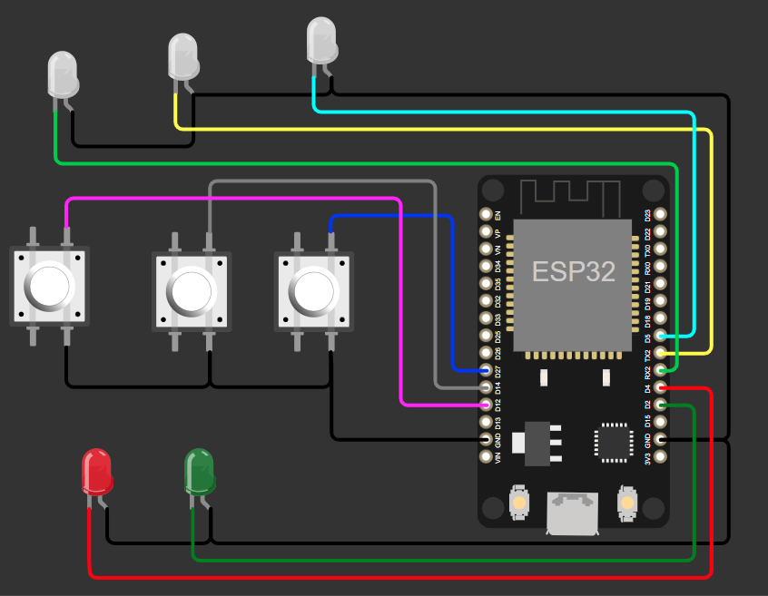
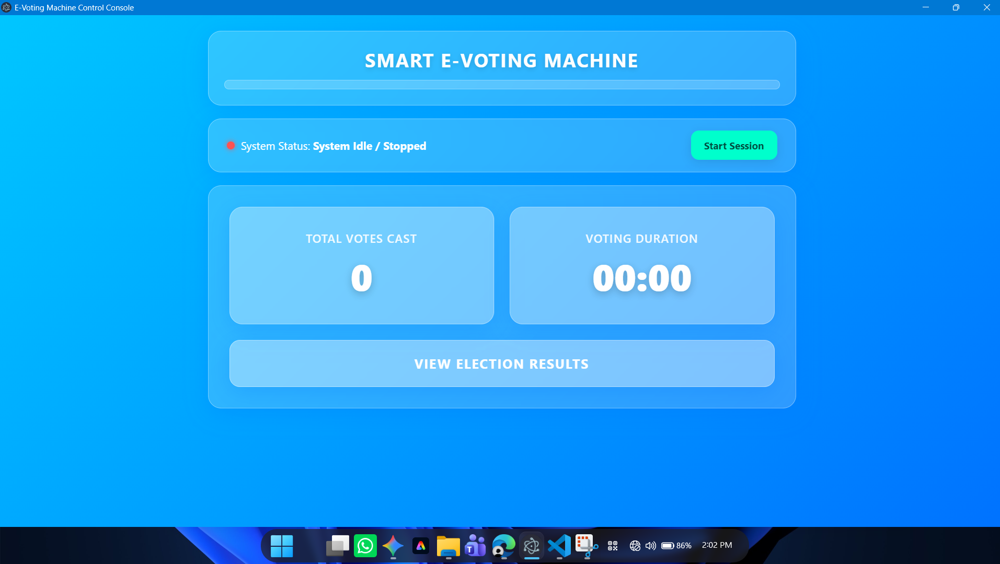
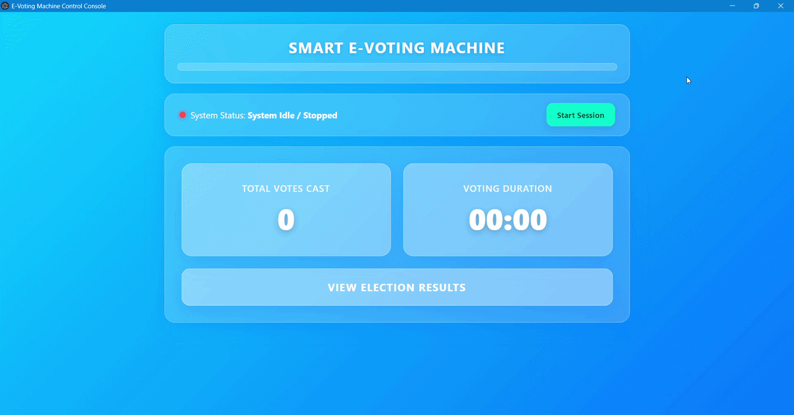
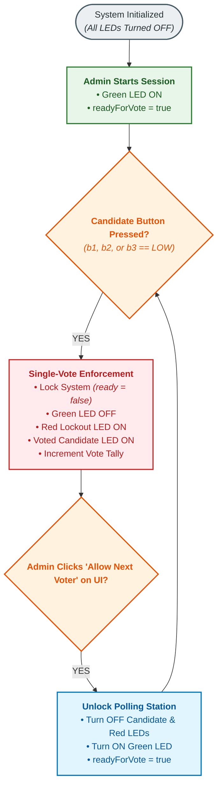
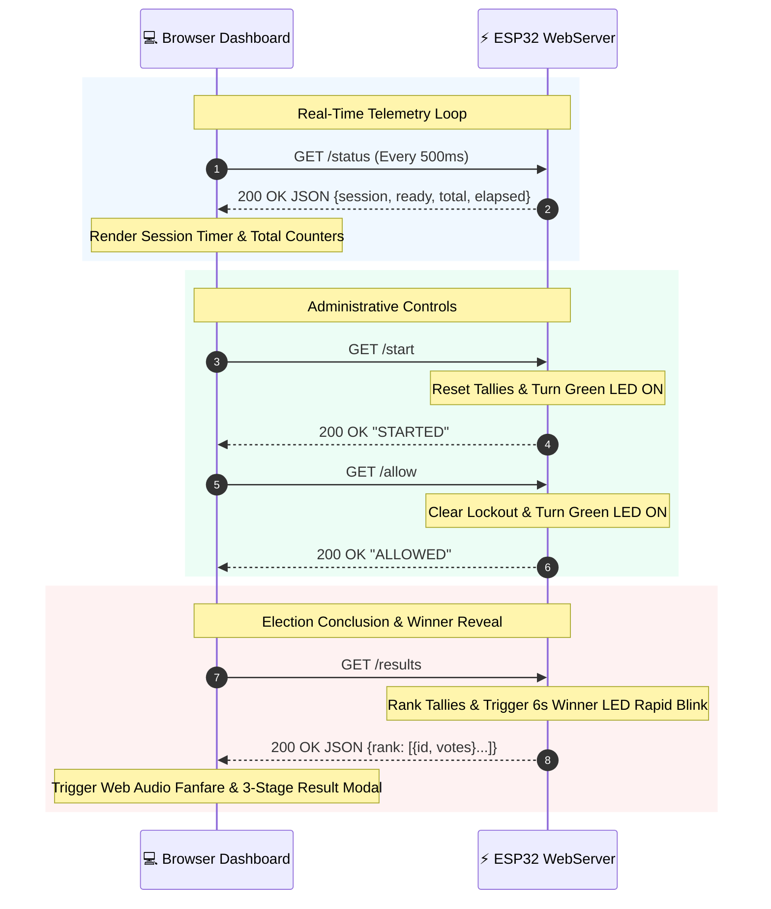

# 🗳️ Smart E-Voting Machine with Web Dashboard

An IoT-enabled, anti-tamper Electronic Voting System built using the **ESP32** microcontroller and an asynchronous, web-based administrative control dashboard. 

The system leverages local Wi-Fi communication to serve a responsive **Glassmorphic Web UI** that streams real-time voting data, tracks session durations, enforces strict single-vote polling lockouts, renders multi-stage winner announcement animations, and synthesizes audio feedback using the browser's native **Web Audio API**.

---

## 👤 Author & Developer Information
<div align="center">

### **Paulwin TP**
*B.Tech Student | Developer & Computer Vision Enthusiast*

[](https://github.com/PaulwinTP)
[](https://www.linkedin.com/in/paulwin-t-p)

## 📸 Media Preview & System Gallery

### 1. Circuit Schematic & Hardware Layout
| Circuit Schematic Diagram |
| :---: | 
|  |
| Physical Hardware Wiring |
| :---: |
|  |
### 2. Live Web Dashboard
| Glassmorphic Administration UI |
| :---: |
|  |

### 3. Video Demonstrations (GIF Previews)

#### Demonstration 1: Full Voting & Authorization Walkthrough

*Demonstrates starting a session from the web dashboard, voter polling, hardware status LED transitions, admin authorization lockout, and laptop audio chimes.*

#### Demonstration 2: Animated Election Results & Victory Sequence

*Demonstrates the 3-stage animated modal (data fetching, candidate rank breakdown, winner declaration) and hardware LED rapid-blink sequence.*

---

## 📊 System Working Logic & Flowcharts

### 1. Hardware State Machine Flow

### 2. Web Dashboard Telemetry & Polling Flow

---

## 🌟 Key Features

* **Anti-Tamper Hardware Lockout:** Prevents vote stuffing or multiple button presses by immediately locking out further inputs as soon as a vote is registered.
* **Administrator Session Authorization:** Requires the election official to click **"Allow Next Voter"** on the laptop dashboard before the machine accepts the next vote.
* **Glassmorphic Web UI:** Modern, frost-glass user interface with responsive layout, live session timer, and real-time total vote counter.
* **Non-Blocking Architecture:** Built entirely around non-blocking timing patterns, ensuring the HTTP REST server handles requests smoothly without execution freezes.
* **Web Audio Synthesis:** Integrated Web Audio API triggers interactive tone synthesis through the laptop speakers without requiring extra physical audio modules on the ESP32.
* **CORS-Enabled REST API:** Provides explicit communication endpoints formatted in structured JSON.

---

## ⚙️ System Modules

The system operates as a hardware-software cooperative split into four core modules:

### 1. Hardware Polling Station Module
* **Voter Input Panel:** Consists of three candidate push-buttons set up with internal pull-up logic (`INPUT_PULLUP`) to detect physical presses cleanly.
* **Status Feedback LEDs:** 
  * **Green LED (Ready):** Illuminates when the machine is active and ready to accept a vote.
  * **Red LED (Lockout):** Illuminates as soon as a vote is registered, signalling that the polling booth is locked.
  * **White Candidate LEDs:** Turn on specifically for the candidate who received the vote to confirm registration.

### 2. Central Microprocessor & Web Server Module
* The ESP32 acts as a standalone Access Point (SoftAP), broadcasting a dedicated local Wi-Fi network.
* Runs an embedded HTTP Web Server listening on Port 80, receiving administrative commands and serving real-time system state via JSON.

### 3. Web-Based Administrative Dashboard Module
* **Real-time Telemetry:** Polls the machine state every 500 milliseconds to update session time, readiness status, and vote tallies dynamically.
* **Session Controls:** Allows the admin to start a new election session, pause/stop the session, or authorize the next voter.
* **3-Stage Animated Election Winner Reveal:** When the administrator clicks "View Election Results", the UI executes a staged reveal (Fetching Data $\rightarrow$ Candidate Rank Breakdown $\rightarrow$ Grand Winner Declaration).

### 4. Web Audio Synthesizer Module
* Uses the browser’s native **Web Audio API** to generate real-time audio frequencies through the laptop speakers:
  * **Vote Recorded:** Low-pitch confirmation beep.
  * **Voter Authorized:** Dual-tone success chime when "Allow Next Voter" is pressed.
  * **Election Victory:** A multi-note fanfare during the winner reveal.

---

## 🛡️ Security & Anti-Tamper Features

1. **Immediate Hardware Lockout:**
   As soon as a candidate button is pressed, the machine state instantly flips to locked mode within the same processing cycle. Subsequent button presses are completely ignored by the microcontroller until authorized by the administrator.

2. **Dual-Stage Switch Debouncing:**
   Employs hardware pull-ups combined with a dual-stage software delay window (350ms primary check + 50ms pin stability verification) to prevent electrical contact chatter, false triggers, or mechanical double-clicks.

3. **Isolated Network Access (Air-Gapped SoftAP):**
   The ESP32 broadcasts an isolated local Wi-Fi network secured with WPA2-PSK encryption. The system does not connect to the public internet, preventing remote cyber-attacks or external data tampering.

4. **Zero-State Counter Resetting:**
   Initiating a new voting session explicitly clears all runtime counters from memory and establishes a fresh time epoch, eliminating lingering ghost data from previous rounds.

---
---
### 🚀 Smart EVM Console v1.0.0

Standalone Windows control application for the ESP32 E-Voting System.

#### Features:
- Live voter polling & status monitoring
- Anti-tamper administrative controls
- Integrated audio feedback & result modal triggers

#### Installation:
Download `Smart EVM Console 1.0.0.exe` below and run it directly on Windows (no installation required).


---

## 🔌 Circuit Pinout & Wiring Specifications

| Component | ESP32 GPIO Pin | Connection Details | Active Logic |
| :--- | :--- | :--- | :--- |
| **Candidate 1 Button** | `GPIO 12` | Push-button to GND | Active LOW |
| **Candidate 2 Button** | `GPIO 14` | Push-button to GND | Active LOW |
| **Candidate 3 Button** | `GPIO 27` | Push-button to GND | Active LOW |
| **Green LED (Ready)** | `GPIO 2` | Anode (+) via 220Ω Resistor to Pin, Cathode (-) to GND | Active HIGH |
| **Red LED (Lockout)** | `GPIO 4` | Anode (+) via 220Ω Resistor to Pin, Cathode (-) to GND | Active HIGH |
| **Candidate 1 LED** | `GPIO 16` (RX2) | Anode (+) via 220Ω Resistor to Pin, Cathode (-) to GND | Active HIGH |
| **Candidate 2 LED** | `GPIO 17` (TX2) | Anode (+) via 220Ω Resistor to Pin, Cathode (-) to GND | Active HIGH |
| **Candidate 3 LED** | `GPIO 5` | Anode (+) via 220Ω Resistor to Pin, Cathode (-) to GND | Active HIGH |

---

## 🌐 API Endpoint Reference

| Endpoint | Method | Response Type | Description |
| :--- | :--- | :--- | :--- |
| `/status` | `GET` | `application/json` | Returns `session` state, `ready` lockout status, `total` votes, and `elapsed` seconds. |
| `/start` | `GET` | `text/plain` | Resets vote counts, turns Green LED ON, and starts the session timer. |
| `/stop` | `GET` | `text/plain` | Deactivates session, disables voting buttons, and shuts down all LEDs. |
| `/allow` | `GET` | `text/plain` | Clears Red lockout LED, turns Green LED ON, and unlocks candidate polling. |
| `/results` | `GET` | `application/json` | Ranks candidate totals descendingly and triggers the winner's LED rapid-blink sequence. |

---

## 🛠️ Project Structure

```text
ESP32-Smart-Voting-Machine/
│
├── README.md                 <-- Overview, modules, wiring, diagrams & author info
│
├── assets/                   <-- Local folder containing diagrams, photos & GIFs
│   ├── circuit_diagram.png   <-- Circuit schematic
│   ├── hardware_setup.jpg    <-- Physical ESP32 hardware photo
│   ├── dashboard_preview.png <-- Web UI screenshot
│   ├── voting_process.gif    <-- Demonstration GIF 1
│   └── results_announcement.gif <-- Demonstration GIF 2
│
├── Hardware/
│   └── sketch_aug7a.ino      <-- ESP32 firmware source file
│
└── Software/
    └── Smart EVM Console 1.0.0  <--Windows software for the dashboard
    └── index.html            <--  web dashboard code
